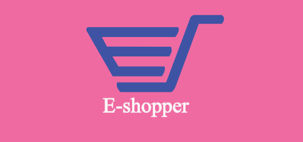

## About E-shopper

E-shopper is a website  application  to make online shopping that contains many features :
* enter into it without register , by using user account , and admin account 
Which is : 

**Pages without need into register**
- will show : 
  * home page : 
   contains on many sections 
    - search a product or products
    - view all t-shirts 
    - view all bags
    - view all dresses
    - view products : 
       * that exist in website -> high quantity 
       * that exist in website -> high price
       * that exist in website -> high feature 
    - Modern Products  
    - make subscribe in website
    - all pages categories and products that it  inside these categories and view details this product , 
       but can not make any functionlaty in page view details (add to cart , add to fav , add review)
    - contact , but  must be register in website
So will register in website to make these functionalty and more .

you can see this video to see more :
https://drive.google.com/open?id=1rNW403M7_uFlFQTcVniLOFjGNSPrB2kK
----------------------------------------------------------------

**Pages when register**
 - when register in website will send into email to confirmation , after this confirmation , when enter in website will send another message (Welcome message)
Now 💯 
this user can make many functionalty:
1. edit profile user and add image
2.  add a product into your cart  beside word cart
3.  show your cart that it contains these products
now became num 2 in navbar as you seen 
4. add a product into favourite, also will change the num in navbar beside word favoruite
5. see all reviewer a product, and your review on this product , and  when show reviews on this product , if your review is exist in it , you  can edit and delete it , but another reviews  , you can't make any fun on it , because these not for me.
5. add a product into your orders
6.  view details order that contains on a product.
7. make payment by using COD , and will come  a msg into your email contains all information on my order and type payment method
8. make delivery:  this step before view your order 
9. add or edit a coupon.
10.  section contact us to send msg into admin email 
11. edit your password
12. reset the password ,  it redirects into login direct and sends a msg into this email, i will check it to enter in the password that it send in email
13. can share this website in another websites like : facbook , email and so on
14.  check pincode in page view Details .

you can see this video to see more :
https://drive.google.com/file/d/1fnUNlJ-A4eR3LhwHL8CpkdjW4gCi2zyE/view
----------------------------------------------------------------

**Pages in Admin Account**

* admin can add/edit/delete:

    1- main category 
    2- sub category 
    3- products in this subCategory 
    4- details a product 
    5- banner
    6- cart 
    7- order 
    8- coupon.

        And exsit  num status means that : 
        this main category conatins  enough sub category or not 
        if 0: will be come soon 
        if 1 : will be finish
        if 2 : exsit enough quantity 

* admin can view all admins , which is  exsit main admins and subadmin 
which is the main admin , can view and make any functionalty in nay page , but the subAdmin , just can view these pages and make some functionlaty , accorrding the accessbilty
such as : 
	ali@gmail.com this email is subAdmin becuase he has not all accessbilty 
    will can not show page products and edit category . 
    But  Admin  can do all things 

you can see this video to see more :

http://www.mediafire.com/file/lnrpi566mfxvbj8/Admin_accont.mp4/file
## Developed by :
- **[Eng-Alaa Badra](https://www.linkedin.com/in/eng-alaa-badra/)**

## My Wishes

I hope enjoy in my website .

